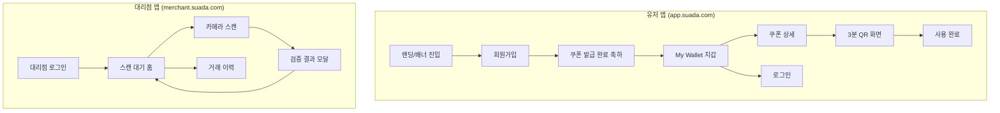
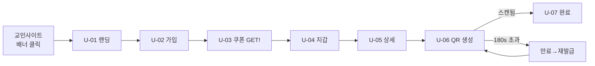

# 🎨 UI/UX 디자인 명세서 (UI/UX Design Specification)

**프로젝트:** SUADA-O2O-MVP
**작성 부서:** UI/UX Design Office
**문서 버전:** v1.0
**분류:** Design / Confidential
**SoT 기준:** CTO Technical Architecture Document v1.0

---

## 📑 목차

1. [디자인 철학 및 원칙](#1-디자인-철학-및-원칙)
2. [디자인 시스템 (Design Tokens)](#2-디자인-시스템-design-tokens)
3. [정보 구조 (IA) 및 사이트맵](#3-정보-구조-ia-및-사이트맵)
4. [유저 앱 (Frontend-User) 화면 플로우](#4-유저-앱-frontend-user-화면-플로우)
5. [대리점 앱 (Frontend-Merchant) 화면 플로우](#5-대리점-앱-frontend-merchant-화면-플로우)
6. [핵심 인터랙션: 3분 QR 타이머](#6-핵심-인터랙션-3분-qr-타이머)
7. [실시간 알림 UX](#7-실시간-알림-ux)
8. [상태별 화면 정의 (State Matrix)](#8-상태별-화면-정의-state-matrix)
9. [접근성 & 반응형 가이드](#9-접근성--반응형-가이드)

---

## 1. 디자인 철학 및 원칙

### 1.1 핵심 디자인 원칙

| 원칙 | 설명 | 적용 화면 |
|------|------|-----------|
| **시간의 가시화 (Time-Visible)** | 3분 만료를 직관적으로 인지시켜 불안 최소화 | QR 화면 원형 타이머 |
| **단일 행동 집중 (One-Action Focus)** | 카페 현장에서 한 손/한 동작으로 끝남 | 쿠폰 사용 버튼, 스캔 화면 |
| **즉각적 피드백 (Instant Feedback)** | 모든 트랜잭션 결과를 1초 내 시각/촉각/청각으로 통지 | 음료 지급 알림 |
| **신뢰의 시각화 (Trust-Visual)** | 보안 QR/소멸 처리를 '확실히 끝났음'으로 표현 | 소멸 완료 애니메이션 |
| **도메인 분리 미감 (Domain Identity)** | 유저(따뜻함) vs 대리점(효율) 톤 분리 | 컬러 테마 분기 |

### 1.2 두 개의 페르소나, 두 개의 톤

```
[유저 앱 - "교민 카페 손님"]          [대리점 앱 - "바쁜 카운터 직원"]
감성적 / 환영하는 / 부드러운          기능적 / 빠른 / 명확한
라운드 코너, 따뜻한 브라운            큰 버튼, 고대비, 카메라 우선
모바일 PWA 우선                       태블릿 가로/세로 대응
```

---

## 2. 디자인 시스템 (Design Tokens)

### 2.1 컬러 팔레트

```css
:root {
  /* === Brand (카페 스아다 - 커피/온기) === */
  --suada-coffee:     #6F4E37;  /* 메인 브라운 */
  --suada-espresso:   #3B2A20;  /* 딥 다크 */
  --suada-cream:      #F5EBE0;  /* 배경 크림 */
  --suada-latte:      #D9C4B0;  /* 서브 */
  --suada-gold:       #C9A227;  /* 쿠폰 강조(프리미엄) */

  /* === Semantic === */
  --color-success:    #2E9E5B;  /* 소멸 성공/음료지급 */
  --color-warning:    #E8A317;  /* 만료 임박(30s↓) */
  --color-danger:     #D64545;  /* 만료/오류 */
  --color-info:       #3B82C4;

  /* === Neutral === */
  --gray-900:#1A1A1A; --gray-700:#3F3F3F; --gray-500:#767676;
  --gray-300:#D4D4D4; --gray-100:#F2F2F2; --white:#FFFFFF;

  /* === Merchant Theme (효율/집중) === */
  --merchant-bg:      #0F1419;  /* 다크 배경(카메라 대비) */
  --merchant-accent:  #00D98B;  /* 스캔 성공 네온 그린 */
}
```

### 2.2 타이포그래피

| 토큰 | 크기/굵기 | 용도 |
|------|-----------|------|
| `display` | 32px / 700 | 타이머 숫자, 핵심 금액 |
| `h1` | 24px / 700 | 화면 타이틀 |
| `h2` | 20px / 600 | 섹션 헤더 |
| `body` | 16px / 400 | 본문 |
| `caption` | 13px / 400 | 보조 설명 |
| `button` | 16px / 600 | 버튼 라벨 |

> 폰트: `Pretendard` (한글 가독성 우선) + `Roboto Mono` (타이머 숫자 고정폭)

### 2.3 스페이싱 & 라운딩

```
spacing: 4 / 8 / 12 / 16 / 24 / 32 / 48 (px, 8pt grid)
radius:  sm=8px  md=16px  lg=24px  full=9999px
shadow:  card = 0 2px 12px rgba(111,78,55,0.08)
         modal= 0 8px 32px rgba(0,0,0,0.16)
```

### 2.4 핵심 컴포넌트 라이브러리

| 컴포넌트 | 변형(Variants) | 상태 |
|----------|----------------|------|
| `Button` | primary/secondary/ghost/danger | default/hover/active/disabled/loading |
| `CouponCard` | active/used/expired | - |
| `QRTimerRing` | safe(>60s)/warning(≤30s)/critical(≤10s) | counting/expired |
| `Toast` | success/error/info | enter/exit |
| `StatusBadge` | ISSUED/USED/EXPIRED | - |

---

## 3. 정보 구조 (IA) 및 사이트맵



### 3.1 화면 인벤토리

| ID | 화면명 | 도메인 | 연동 API |
|----|--------|--------|----------|
| U-01 | 랜딩(배너 진입) | User | - |
| U-02 | 회원가입 | User | `POST /auth/signup` |
| U-03 | 쿠폰 발급 축하 | User | (signup 응답 활용) |
| U-04 | My Wallet | User | `GET /wallet/coupons` |
| U-05 | 쿠폰 상세 | User | `GET /coupons/:id` |
| U-06 | 3분 QR 화면 | User | `POST /coupons/:id/qr` |
| U-07 | 사용 완료 | User | (Socket/폴링) |
| U-08 | 로그인 | User | `POST /auth/login` |
| M-01 | 대리점 로그인 | Merchant | `POST /merchant/login` |
| M-02 | 스캔 대기 홈 | Merchant | Socket `merchant:join` |
| M-03 | 카메라 스캔 | Merchant | `POST /merchant/redeem` |
| M-04 | 검증 결과 모달 | Merchant | (redeem 응답) |
| M-05 | 거래 이력 | Merchant | `GET /merchant/transactions` |

---

## 4. 유저 앱 (Frontend-User) 화면 플로우

### 4.1 전체 유저 여정 (User Journey)



---

### 4.2 U-02 회원가입 화면

**레이아웃 구조**
```
┌─────────────────────────────┐
│  ← 뒤로            로그인 →   │  헤더(ghost)
├─────────────────────────────┤
│                             │
│   ☕ 카페 스아다              │  브랜드 마크(coffee색)
│   10% 할인 쿠폰을            │  h1
│   지금 받으세요              │
│                             │
│  ┌───────────────────────┐  │
│  │ 📧 이메일              │  │  input (radius md)
│  └───────────────────────┘  │
│  ┌───────────────────────┐  │
│  │ 📱 휴대폰 번호         │  │
│  └───────────────────────┘  │
│  ┌───────────────────────┐  │
│  │ 🔒 비밀번호            │  │
│  └───────────────────────┘  │
│                             │
│  ┌───────────────────────┐  │
│  │   가입하고 쿠폰 받기   │  │  Button primary(coffee)
│  └───────────────────────┘  │  full-width, 56px
│                             │
│  가입 시 이용약관 동의       │  caption(gray-500)
└─────────────────────────────┘
```

**인터랙션 흐름**
| 단계 | 트리거 | 시스템 반응 | 시각 피드백 |
|------|--------|-------------|-------------|
| 1 | 필드 입력 | 실시간 유효성(Zod) | 통과 시 우측 ✓ 녹색 |
| 2 | 이메일 형식 오류 | 인라인 에러 | 필드 하단 `danger` 텍스트 + shake |
| 3 | "가입" 탭 | 버튼 loading 스피너 | 라벨→"쿠폰 발급 중…" |
| 4 | 201 응답 | U-03 전환 + `source` 자동전송 | 페이지 슬라이드업 전환 |
| 5 | 409(중복 이메일) | Toast error | "이미 가입된 이메일입니다" |

> **숨은 데이터:** 배너 URL의 `?source=banner_kyomin_001` 쿼리를 hidden으로 보관 → `signup` payload에 자동 첨부 (UTM 트래킹).

---

### 4.3 U-03 쿠폰 발급 축하 화면 (감성 모먼트)

```
┌─────────────────────────────┐
│         🎉 (컨페티 애니)     │
│                             │
│    축하합니다!               │  h1
│    쿠폰이 발급되었어요        │
│                             │
│  ┌───────────────────────┐  │
│  │ ╔═══════════════════╗ │  │  CouponCard
│  │ ║  카페 스아다       ║ │  │  (gold 테두리,
│  │ ║   10% 할인         ║ │  │   살짝 기울며 등장)
│  │ ║                   ║ │  │
│  │ ║  SUADA-A1B2C3     ║ │  │  Roboto Mono
│  │ ╚═══════════════════╝ │  │
│  └───────────────────────┘  │
│                             │
│  ┌───────────────────────┐  │
│  │   내 지갑에서 보기     │  │  Button primary
│  └───────────────────────┘  │
└─────────────────────────────┘
```

**모션 시퀀스 (0→1.2초)**
1. `0.0s` 배경 페이드인 (cream)
2. `0.2s` 컨페티 버스트 (gold/coffee 입자)
3. `0.4s` 쿠폰카드 scale(0.8→1) + rotate(-3°→0°) spring
4. `0.8s` 쿠폰코드 타이핑 효과
5. `1.0s` CTA 버튼 슬라이드업

---

### 4.4 U-04 My Wallet (지갑)

```
┌─────────────────────────────┐
│  내 지갑              ⚙️     │  헤더
│  보유 쿠폰 2장               │  caption
├─────────────────────────────┤
│  [ 사용가능 ]  [ 사용완료 ]  │  세그먼트 탭
├─────────────────────────────┤
│  ┌───────────────────────┐  │
│  │ ☕ 카페 스아다  [사용가능]│ │  CouponCard active
│  │ 10% 할인               │  │  좌측 gold 액센트바
│  │ SUADA-A1B2C3           │  │
│  │ 발급일 2025.05.26      │  │
│  │           [ 사용하기 ▶]│  │  Button primary(우하단)
│  └───────────────────────┘  │
│  ┌───────────────────────┐  │
│  │ ☕ 카페 스아다  [완료]  │  │  CouponCard used
│  │ 10% 할인 (흐림처리)    │  │  opacity 0.5 + 대각선
│  │ 사용일 2025.05.20      │  │  "USED" 워터마크
│  └───────────────────────┘  │
└─────────────────────────────┘
```

**카드 상태별 시각 규칙**
| status | 테두리 | 배경 | 액션 | 워터마크 |
|--------|--------|------|------|----------|
| ISSUED | gold 2px | white | "사용하기" 활성 | - |
| USED | gray 1px | gray-100 | 비활성 | 대각선 "USED" |
| EXPIRED | danger 1px | gray-100 | "재발급"(선택) | "EXPIRED" |

---

### 4.5 U-05 → U-06 쿠폰 상세 & QR 생성

**상세에서 "사용하기" 탭 → QR 화면 전환**

```
[U-05 쿠폰 상세]              [U-06 3분 QR 화면]
"사용하기" 탭                 화면 전환(즉시)
   │                              │
   ▼                              ▼
POST /coupons/:id/qr  ───►  토큰+expiresAt 수신
   │                              │
   ▼                              ▼
loading 모달(0.3s)          QR 렌더 + 타이머 시작
```

---

## 5. 대리점 앱 (Frontend-Merchant) 화면 플로우

### 5.1 M-01 대리점 로그인 (다크 테마)

```
┌─────────────────────────────┐
│        (merchant-bg 다크)    │
│                             │
│      🏪 SUADA MERCHANT       │  네온 그린 로고
│                             │
│  ┌───────────────────────┐  │
│  │ 매장 ID                │  │  다크 input
│  └───────────────────────┘  │
│  ┌───────────────────────┐  │
│  │ 비밀번호               │  │
│  └───────────────────────┘  │
│  ┌───────────────────────┐  │
│  │       로그인           │  │  Button(merchant-accent)
│  └───────────────────────┘  │
└─────────────────────────────┘
```

> 로그인 성공 → JWT(MERCHANT) 저장 → 즉시 Socket `/merchant` 네임스페이스 연결 + `merchant:join` 발신.

---

### 5.2 M-02 스캔 대기 홈 (실시간 연결 상태)

```
┌─────────────────────────────┐
│ 카페 스아다      🟢 실시간연결 │  헤더 + 연결상태 인디케이터
│ 오늘 지급 14잔               │  caption
├─────────────────────────────┤
│                             │
│         ┌─────────┐         │
│         │  📷     │         │  대형 스캔 진입 버튼
│         │  QR     │         │  (merchant-accent 글로우)
│         │ 스캔하기 │         │  220x220px 원형/라운드
│         └─────────┘         │
│                             │
│   손님의 QR을 스캔하세요      │  body(중앙)
│                             │
├─────────────────────────────┤
│  최근 거래                   │  h2
│  • 10% · 방금 전             │  실시간 리스트(상단 추가)
│  • 10% · 3분 전             │
│                  [전체보기→] │  → M-05 이동
└─────────────────────────────┘
```

**연결 상태 인디케이터**
| 상태 | 표시 | 색상 |
|------|------|------|
| Socket 연결됨 | 🟢 실시간연결 | merchant-accent |
| 재연결 중 | 🟡 연결 중… (펄스) | warning |
| 끊김 | 🔴 오프라인(폴링모드) | danger |

> **장애 격리 UX:** Socket 끊겨도 스캔(REST)은 정상 동작. 알림만 폴백 폴링으로 전환됨을 인지시킴.

---

### 5.3 M-03 카메라 스캔 화면

```
┌─────────────────────────────┐
│ ✕ 닫기              💡 플래시 │  오버레이 헤더
│                             │
│   ┌───────────────────┐     │
│   │                   │     │  카메라 라이브뷰(전체)
│   │   ┌─────────┐     │     │  중앙 스캔 가이드 프레임
│   │   │  [QR]   │     │     │  (네온 그린 코너 마커)
│   │   │         │     │     │  ← 스캔라인 상하 이동 애니
│   │   └─────────┘     │     │
│   │                   │     │
│   └───────────────────┘     │
│                             │
│   QR 코드를 프레임 안에 맞추세요 │  하단 안내 텍스트
└─────────────────────────────┘
```

**스캔 인터랙션 시퀀스**
| 단계 | 상태 | 시각/촉각 피드백 |
|------|------|------------------|
| 1 | 탐지 대기 | 스캔라인 애니메이션 루프 |
| 2 | QR 인식 순간 | 프레임 코너 그린 플래시 + 짧은 진동(haptic) |
| 3 | `POST /redeem` 호출 | 중앙 스피너 오버레이 "검증 중…" |
| 4 | 응답 수신 | M-04 결과 모달 슬라이드업 |

> **중복 스캔 방지 UX:** 1회 인식 후 즉시 카메라 일시정지 → 응답 전까지 재스캔 차단 (CTO의 Lua 원자성과 더불어 UI단 1차 차단).

---

### 5.4 M-04 검증 결과 모달 (3가지 분기)

#### ✅ SUCCESS (200)
```
┌─────────────────────────────┐
│                             │
│         ✓ (네온 그린         │  체크 애니(scale spring)
│         원형 펄스)           │
│                             │
│      음료를 지급하세요!       │  display(32px)
│                             │
│   ┌───────────────────────┐ │
│   │   10% 할인 적용         │ │  강조 박스
│   │   SUADA-A1B2C3 · 소멸  │ │
│   └───────────────────────┘ │
│                             │
│  ┌───────────────────────┐  │
│  │      확인 (다음 손님)   │  │  Button(accent) full
│  └───────────────────────┘  │
└─────────────────────────────┘
```
> 모달 등장과 동시: **성공 사운드 + 강한 진동** + 배경 그린 글로우 플래시.

#### ⏱ EXPIRED (410) / ⛔ ALREADY_USED (409)
```
┌─────────────────────────────┐
│         ✕ (danger 원형)      │  X 애니(shake)
│                             │
│   [410] QR이 만료되었습니다   │  h1 (danger)
│   손님께 재발급을 요청하세요  │  body
│   ───────────────────────   │
│   [409] 이미 사용된 쿠폰입니다 │  (분기 텍스트)
│                             │
│  ┌───────────────────────┐  │
│  │      다시 스캔하기      │  │  Button(ghost outline)
│  └───────────────────────┘  │
└─────────────────────────────┘
```

**결과 모달 분기 매핑 (CTO API 응답 → UI)**
| `result` | HTTP | 아이콘/색 | 헤드라인 | 액션 |
|----------|------|-----------|----------|------|
| SUCCESS | 200 | ✓ green | "음료를 지급하세요!" | 확인→대기홈 |
| EXPIRED | 410 | ⏱ danger | "QR이 만료되었습니다" | 다시 스캔(재발급 요청) |
| ALREADY_USED | 409 | ⛔ danger | "이미 사용된 쿠폰입니다" | 다시 스캔 |
| INVALID | 400 | ⚠ warning | "유효하지 않은 코드입니다" | 다시 스캔 |
| 401/403 | - | 🔒 | "로그인이 필요합니다" | 재로그인 |

---

### 5.5 M-05 거래 이력

```
┌─────────────────────────────┐
│ ← 거래 이력         📅 기간   │  헤더 + 날짜필터
│ 총 153건 · 오늘 14건         │
├─────────────────────────────┤
│ 2025.05.26                  │  날짜 섹션 헤더(sticky)
│  ┌───────────────────────┐  │
│  │ SUADA-A1B2C3           │  │  거래 row
│  │ 10% 할인 · 10:32:11    │  │
│  └───────────────────────┘  │
│  ┌───────────────────────┐  │
│  │ SUADA-X9Y8Z7           │  │
│  │ 10% 할인 · 09:15:40    │  │
│  └───────────────────────┘  │
│         (무한 스크롤 페이징)  │  ?page=n&limit=20
└─────────────────────────────┘
```

---

## 6. 핵심 인터랙션: 3분 QR 타이머

### 6.1 U-06 QR 화면 풀 레이아웃

```
┌─────────────────────────────┐
│  ← 지갑으로                  │  헤더
├─────────────────────────────┤
│                             │
│      직원에게 보여주세요      │  h2(중앙)
│                             │
│      ╭───────────────╮      │
│      │   ◜ 02:47 ◝   │      │  ← QRTimerRing
│      │  ┌─────────┐  │      │     (원형 SVG 게이지가
│      │  │ ▓▓ QR ▓▓ │  │      │      QR을 감쌈)
│      │  │ ▓▓▓▓▓▓▓ │  │      │
│      │  └─────────┘  │      │
│      ╰───────────────╯      │
│                             │
│   10% 할인 · SUADA-A1B2C3    │  caption
│                             │
│   ⓘ 3분 후 자동 만료됩니다    │  안내(info)
│  ┌───────────────────────┐  │
│  │      QR 새로고침        │  │  Button(ghost, 만료시 활성)
│  └───────────────────────┘  │
└─────────────────────────────┘
```

### 6.2 타이머 시각 상태 (서버 expiresAt 기준)

> **CTO 원칙 준수:** 카운트다운은 **서버 `expiresAt` 절대시각** 기준으로 계산. 클라이언트 타이머는 *표시 전용*이며 만료 판정의 최종 권한은 서버(Redis TTL)에 있음.

```javascript
// 표시용 계산 (SoT는 서버)
const remainMs = new Date(expiresAt).getTime() - Date.now();
```

| 잔여시간 | Variant | 링 색상 | 숫자 색상 | 추가 효과 |
|----------|---------|---------|-----------|-----------|
| 180~61s | `safe` | coffee | gray-900 | 부드러운 감소 |
| 60~31s | `safe` | coffee | gray-900 | - |
| 30~11s | `warning` | gold | warning | 링 펄스(1Hz) |
| 10~1s | `critical` | danger | danger | 숫자 확대 펄스 + 진동 |
| 0s | `expired` | gray-300 | gray-500 | QR 블러처리 + 만료 오버레이 |

### 6.3 만료 시 처리

```
[00:00 도달]
   │
   ▼
QR 영역 블러(8px) + 반투명 오버레이
   │
   ▼
┌───────────────────┐
│  ⏱ QR이 만료됐어요  │
│  [ 새 QR 발급 ]    │  ← POST /coupons/:id/qr 재호출
└───────────────────┘
   │
   ▼ (재발급 성공)
새 토큰으로 타이머 180s 재시작
```

### 6.4 QR 화면 ↔ 소멸 실시간 연동 (유저 측)

| 트리거 | 유저 화면 반응 |
|--------|----------------|
| 대리점이 스캔 성공(서버 소멸) | (폴링 or Socket) QR화면→U-07 완료 자동 전환 |
| 180초 경과 | 만료 오버레이 표시 |
| 유저가 지갑 복귀 | QR 토큰 유지(만료 전), 재진입 시 잔여시간 이어서 표시 |

---

### 6.5 U-07 사용 완료 화면

```
┌─────────────────────────────┐
│                             │
│       ✓ (success 원형        │
│       체크 + 잔물결)         │
│                             │
│    사용 완료되었습니다        │  h1
│    맛있게 드세요 ☕           │  body
│                             │
│   ┌───────────────────────┐ │
│   │ 카페 스아다 10% 할인    │ │  요약카드(used 톤)
│   │ 사용 2025.05.26 10:32  │ │
│   └───────────────────────┘ │
│                             │
│  ┌───────────────────────┐  │
│  │      지갑으로 돌아가기   │  │  Button primary
│  └───────────────────────┘  │
└─────────────────────────────┘
```

---

## 7. 실시간 알림 UX

### 7.1 대리점 "음료 지급" 실시간 알림 (Socket `coupon_redeemed`)

스캔 주체가 본인이 아니어도(예: 다른 단말), 룸 전체에 알림이 도달하는 경우를 대비:

```
┌─────────────────────────────┐
│ ╔═════════════════════════╗ │  화면 상단 슬라이드다운 배너
│ ║ 🔔 음료 지급 · 10% 할인  ║ │  (merchant-accent 배경)
│ ║    방금 전               ║ │  3초 후 자동 수축
│ ╚═════════════════════════╝ │  + 사운드 + 진동
└─────────────────────────────┘
```

### 7.2 알림 채널 매트릭스

| 이벤트 | 유저 앱 | 대리점 앱 | Discord(운영자) |
|--------|---------|-----------|------------------|
| 쿠폰 소멸 성공 | U-07 전환 | M-04 모달 + 상단배너 + 사운드/진동 | 웹훅 카드 |
| QR 만료 | 만료 오버레이 | - | - |
| Socket 끊김 | - | 🔴 인디케이터 + 폴백 폴링 | - |

> **Discord는 운영자 전용**으로 UI 화면 없음 → 메시지 카드 포맷만 가이드(아래).

### 7.3 Discord 알림 카드 포맷 (참고 디자인)

```
┌──────────────────────────────┐
│ ☕ 카페 스아다 · 쿠폰 소멸 완료  │  (embed title)
│ ──────────────────────────── │
│ 할인율   : 10%                │
│ 쿠폰코드 : SUADA-A1B2C3        │
│ 시각     : 2025-05-26 10:32   │
│ 매장     : 카페 스아다          │
│ color: #2E9E5B (success)     │
└──────────────────────────────┘
```

---

## 8. 상태별 화면 정의 (State Matrix)

### 8.1 공통 시스템 상태 (모든 화면 적용)

| 상태 | 화면 처리 | 컴포넌트 |
|------|-----------|----------|
| **Loading** | 스켈레톤(리스트) / 스피너(액션) | `Skeleton`, `Spinner` |
| **Empty** | 일러스트 + 안내문 + CTA | `EmptyState` |
| **Error(네트워크)** | 전면 재시도 화면 | `ErrorBoundary` + "다시 시도" |
| **Offline** | 상단 고정 배너 | `OfflineBar` |

### 8.2 화면별 Empty / Error 정의

| 화면 | Empty 케이스 | Empty 메시지 |
|------|-------------|--------------|
| U-04 지갑 | 쿠폰 0장 | "아직 쿠폰이 없어요 🤍" + "쿠폰 받으러 가기" |
| M-05 거래이력 | 거래 0건 | "오늘 첫 손님을 기다리고 있어요" |
| M-03 스캔 | 카메라 권한 거부 | "카메라 권한을 허용해주세요" + 설정 안내 |

### 8.3 API 에러 → UI 메시지 매핑 (CTO 응답 코드 준수)

| Code | UI 처리 | 사용자 메시지(유저) | 사용자 메시지(대리점) |
|------|---------|---------------------|----------------------|
| 400 | 인라인/Toast | "입력값을 확인해주세요" | "유효하지 않은 코드" |
| 401 | 로그인 화면 리다이렉트 | "다시 로그인해주세요" | "재로그인 필요" |
| 403 | Toast error | "접근 권한이 없습니다" | - |
| 409 | 모달 | "사용할 수 없는 쿠폰입니다" | "이미 사용된 쿠폰" |
| 410 | 모달 | "QR이 만료됐어요(재발급)" | "QR 만료(재발급 요청)" |
| 429 | Toast | "잠시 후 다시 시도해주세요" | "요청이 많습니다" |
| 500 | 전면 에러 | "일시적 오류가 발생했어요" | "서버 오류" |

---

## 9. 접근성 & 반응형 가이드

### 9.1 접근성 (WCAG 2.1 AA)

| 항목 | 기준 | 적용 |
|------|------|------|
| 색 대비 | 4.5:1 이상 | 타이머 숫자/버튼 라벨 검증 완료 |
| 색 비의존 | 색+아이콘+텍스트 병행 | 성공(✓녹색), 실패(✕빨강) 모두 아이콘 동반 |
| 터치 타겟 | 최소 44×44px | 모든 버튼/탭 |
| 스크린리더 | aria-label 부여 | QR 타이머 `aria-live="polite"` 잔여시간 안내 |
| 모션 민감 | `prefers-reduced-motion` | 컨페티/펄스 비활성 대체 |

### 9.2 반응형 브레이크포인트

```
유저 앱(PWA):  Mobile-First
  320~480px : 기본(단일 컬럼)
  481~768px : 중앙 정렬 max-width 420px

대리점 앱:  Tablet 우선
  768px~    : 스캔영역 좌 / 거래리스트 우 (2-pane)
  ~767px    : 단일 컬럼(스캔 풀스크린)
```

### 9.3 대리점 태블릿 2-Pane 레이아웃 (≥768px)

```
┌──────────────────┬──────────────┐
│                  │ 오늘 거래 14건 │
│   📷 카메라 스캔  │ ─────────────│
│   (좌측 메인)     │ • 10% 10:32  │  실시간 갱신
│                  │ • 10% 09:15  │
│   🟢 실시간연결   │ • 10% 08:40  │
│                  │   [전체보기]  │
└──────────────────┴──────────────┘
```

---

## 📌 UI/UX 설계 요약

| 핵심 결정 | 디자인 솔루션 | 비즈니스 가치 |
|-----------|---------------|---------------|
| **3분 한시 QR** | 원형 게이지 링 + 단계별 색/펄스/진동 | 시간 불안 해소, 사용 긴박감 전달 |
| **중복 소멸 차단** | 스캔 후 카메라 즉시 일시정지(UI 1차 차단) | CTO 백엔드 원자성과 이중 안전 |
| **실시간 음료지급** | 모달+사운드+진동+상단배너 | <1초 직원 인지, 빠른 응대 |
| **도메인 분리** | 유저(따뜻 브라운) vs 대리점(다크 효율) | 페르소나별 최적 경험 |
| **장애 격리 UX** | 연결상태 인디케이터 + 폴백 안내 | Socket/Discord 장애 시도 핵심기능 유지 |

---

**문서 끝 (End of UI/UX Document)**
*본 디자인 명세는 Coder 부서 프론트엔드 구현의 기준이며, 모든 화면 상태/인터랙션은 CTO API 응답 코드를 SoT로 매핑한다. 컴포넌트 토큰은 디자인 시스템 섹션을 단일 출처로 한다.*